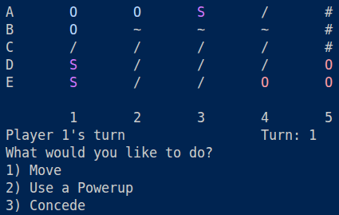

= Dotto C++

This is a C{plus}{plus} implementation of the original https://github.com/MarshTheBacca/dotto.git[dotto]. The intended use was for embedded systems.

== Building and Running

Prerequisites - CMake, gcc, internet connectivity (for CMake to fetch https://github.com/p-ranav/tabulate.git[tabulate])

[source, bash]
----
mkdir build && cd build
cmake ..
cmake --build . -j `nproc`V
./bin/dotto-cpp
----
